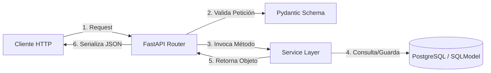
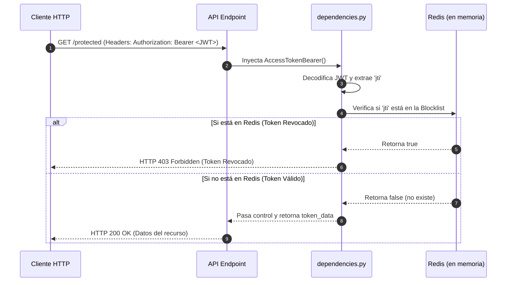

# MANUAL DE ESTUDIO DE ARQUITECTURA BACKEND Y FASTAPI
## 📘 Guía de Consolidación de Arquitectura de Producción y Buenas Prácticas

Este documento sirve como manual teórico-práctico y guía de referencia avanzada para comprender la arquitectura de esta API REST robusta construida con **FastAPI**, **SQLModel**, **PostgreSQL** y **Redis**.

---

## 🧭 ÍNDICE DEL MANUAL
1. [Estructura Base y Servidor Inicial](#1-estructura-base-y-servidor-inicial)
2. [Evolución del CRUD y Arquitectura Limpia](#2-evolución-del-crud-y-arquitectura-limpia)
3. [Sistema de Identidad y Gestión de Usuarios](#3-sistema-de-identidad-y-gestión-de-usuarios)
4. [Seguridad Avanzada y Control de Sesiones](#4-seguridad-avanzada-y-control-de-sesiones)

---

## 1. Estructura Base y Servidor Inicial

### 📂 Instalación y Configuración del Proyecto (Set-Up)
Para un entorno profesional, la estabilidad y el aislamiento de dependencias son primordiales. La aplicación utiliza un entorno virtual virtual (`.venv`) y se configura a través de las siguientes herramientas de primer nivel:
*   **Virtualenv**: Aíslan las librerías del proyecto del entorno global de Python.
*   **Pydantic Settings**: Gestión estricta de variables de entorno con validación de tipo en tiempo de ejecución.
*   **Uvicorn**: Servidor ASGI (Asynchronous Server Gateway Interface) ultrarrápido para Python, construido sobre `uvloop` y `httptools`.

```bash
# Inicialización y activación del entorno virtual (Windows)
python -m venv .venv
.venv\Scripts\activate

# Instalación de dependencias clave
pip install fastapi uvicorn sqlmodel asyncpg cryptography pyjwt pydantic-settings redis
```

### 🏛️ El Porqué Arquitectónico: Servidores Asíncronos y Pydantic Settings
1.  **Modelo Asíncrono (ASGI vs WSGI)**: A diferencia de los frameworks WSGI tradicionales (como Django o Flask en modo tradicional), FastAPI implementa nativamente **ASGI**. Esto permite manejar miles de conexiones simultáneas concurrentes de manera eficiente gracias al bucle de eventos asíncrono (Event Loop) de Python (`async/await`). Esto es crítico para operaciones de Entrada/Salida (I/O) bloqueantes como llamadas a la base de datos o llamadas de red.
2.  **Configuración Tipada (Pydantic Settings)**: Cargar configuraciones mediante `os.environ` sin validar es un antipatrón. El uso de `BaseSettings` asegura que si falta una variable crucial (como `DATABASE_URL` o `JWT_SECRET`) o tiene un tipo incorrecto, el servidor fallará inmediatamente al arrancar ("fail-fast"), protegiendo el entorno de ejecuciones en estado inválido.

### 🧪 Plan de Pruebas QA (Servidor Inicial)
*   **Caso Prueba 1: Arranque Seguro del Servidor**
    *   **Método**: Consola (CLI)
    *   **Comando**: `uvicorn src:app --reload` o ejecutar `python` importando el módulo de rutas.
    *   **Comportamiento Esperado**: El servidor debe iniciar mostrando en los logs el mensaje de lifespan `"Iniciando la aplicacion"`, seguido del levantamiento exitoso de la base de datos (`Base de datos creada exitosamente`).
    *   **Códigos de Estado**: Logs de arranque limpios (0 errores).

---

## 2. Evolución del CRUD y Arquitectura Limpia

### 🏗️ Estructura de Proyecto Grande (Modularización)
El proyecto ha evolucionado de un único archivo monolítico de rutas a una estructura altamente modular y desacoplada bajo el estándar de **Separación de Responsabilidades (SoC)**:

```text
src/
├── database/
│   ├── main.py       # Conexión asíncrona a la base de datos
│   └── redis.py      # Conexión y utilidades de Redis para tokens bloqueados
├── models/
│   └── models.py     # Definición de tablas de la base de datos (SQLModel)
├── routes/
│   ├── books.py      # Rutas modulares para Libros
│   ├── authors.py    # Rutas modulares para Autores
│   ├── users.py      # Rutas modulares para Usuarios
│   └── auth.py       # Rutas modulares para Autenticación
├── schemas/
│   └── schemas.py    # Validación de datos y modelos de transferencia (Pydantic)
├── service/
│   ├── book.py       # Lógica de negocio (Libros y Autores)
│   └── user.py       # Lógica de negocio (Usuarios)
└── utils/
    ├── auth.py       # Generación y validación de tokens JWT
    └── dependencies.py # Proveedores de inyección de dependencia
```

### 🏛️ El Porqué Arquitectónico: SQLModel Asíncrono y Service Pattern
1.  **SQLModel (SQLAlchemy + Pydantic)**: Al combinar la potencia del ORM más robusto de Python (SQLAlchemy) con el validador de datos estándar de la industria (Pydantic), evitamos la duplicación de código. Un único modelo define tanto el esquema de validación de la API como la estructura física de la tabla en la base de datos PostgreSQL.
2.  **Conexión Asíncrona (`asyncpg`)**: Cada consulta a la base de datos es un proceso de I/O bloqueante por naturaleza. Utilizar un motor asíncrono libera al hilo del servidor mientras la base de datos resuelve la consulta, maximizando el rendimiento (throughput) del servidor backend.
3.  **Service Pattern (Capa de Servicios)**: Las rutas (controladores) **nunca** deben realizar consultas SQL directamente. La capa de rutas solo coordina: valida la petición, delega la acción a un servicio (`BookService`, `UserService`), y formatea la respuesta. Esto hace que el código sea altamente testeable mediante pruebas unitarias y mocks de la capa de servicios.



### 🧪 Plan de Pruebas QA (CRUD de Libros & Autores)

#### Obtener Lista de Libros (Público)
*   **Método HTTP**: `GET`
*   **URL**: `http://localhost:8000/api/v1/books`
*   **Headers**: `Accept: application/json`
*   **Comportamiento Esperado**: Retorna una lista con todos los libros registrados y la cantidad total en formato JSON.
*   **Códigos de Estado**: `200 OK`

#### Crear Nuevo Libro (Protegido por Autenticación)
*   **Método HTTP**: `POST`
*   **URL**: `http://localhost:8000/api/v1/book`
*   **Headers**: 
    - `Authorization: Bearer <access_token>`
    - `Content-Type: application/json`
*   **Body (JSON)**:
    ```json
    {
      "title": "El Nombre del Viento",
      "author_name": "Patrick Rothfuss",
      "publisher": "Plaza & Janés",
      "published_date": "2007-03-27",
      "page_count": 662,
      "language": "Español"
    }
    ```
*   **Comportamiento Esperado**: Retorna el libro creado con su UUID asignado y un mensaje de éxito. Si el título ya existe en la base de datos, aborta indicando la colisión. Si el autor especificado en `author_name` no existe previamente en el sistema, arroja un error controlado.
*   **Códigos de Estado**: 
    - `201 Created` (Exitoso)
    - `400 Bad Request` (Espacio ocupado o autor inválido)
    - `401 Unauthorized` / `403 Forbidden` (Token inválido, expirado o ausente)

---

## 3. Sistema de Identidad y Gestión de Usuarios

### 🔒 Modelado Seguro de Cuentas y Hashing
La seguridad en la base de datos comienza por nunca almacenar credenciales en texto plano. La API gestiona esto con la combinación de:
*   **UUID**: Identificadores globales únicos en lugar de claves numéricas secuenciales autoincrementales, previniendo ataques de enumeración de recursos (ID harvesting).
*   **Bcrypt / Passlib**: Algoritmo de hashing adaptativo para transformar contraseñas a través de funciones con factor de coste configurable.

```python
# Representación de exclusión estricta en el modelo de base de datos
password_hash: str = Field(exclude=True) # Nunca se serializa a JSON
```

### 🏛️ El Porqué Arquitectónico: Por qué excluir contraseñas y validar campos
1.  **Exclusión a Nivel de Modelo (`exclude=True`)**: Un error humano común es retornar el hash de la contraseña en las respuestas de la API. SQLModel y Pydantic previenen esto decorando el campo con `exclude=True`, de modo que ni el comando `model_dump()` ni las serializaciones estándar incluyan este valor en la respuesta HTTP.
2.  **Validación de Longitud y Expresiones Regulares**: Validar en base de datos es demasiado tarde e ineficiente. Las validaciones de Pydantic (`max_length`, `min_length`, y correos válidos) se ejecutan antes de tocar cualquier lógica de negocio, reduciendo la carga del servidor de bases de datos.

### 🧪 Plan de Pruebas QA (Gestión de Usuarios)

#### Registro de Usuario Exitoso
*   **Método HTTP**: `POST`
*   **URL**: `http://localhost:8000/api/v1/user`
*   **Headers**: `Content-Type: application/json`
*   **Body (JSON)**:
    ```json
    {
      "username": "tutor_senior",
      "first_name": "Juan",
      "last_name": "Pérez",
      "email": "tutor@fastapi.com",
      "password": "SuperSecurePassword123"
    }
    ```
*   **Comportamiento Esperado**: Retorna el usuario registrado (sin contraseña ni hash) y mensaje de éxito.
*   **Códigos de Estado**: `201 Created`

#### Registro de Usuario Fallido - Duplicado de Correo o Username (Edge Case)
*   **Método HTTP**: `POST`
*   **URL**: `http://localhost:8000/api/v1/user`
*   **Headers**: `Content-Type: application/json`
*   **Body**: *(Mismos datos del caso anterior)*
*   **Comportamiento Esperado**: Retorna un mensaje claro que indica que el username o correo electrónico ya están registrados en el sistema.
*   **Códigos de Estado**: `400 Bad Request`

---

## 4. Seguridad Avanzada y Control de Sesiones

### 🔐 Estructura JWT Estricta
La API utiliza un esquema de doble token (**Access Token** y **Refresh Token**) con el estándar **PyJWT**:

*   **Access Token**: Expiración corta (ej. 1 hora), utilizado para autorizar peticiones a endpoints protegidos.
*   **Refresh Token**: Expiración larga (ej. 6 días), utilizado únicamente para solicitar nuevos tokens de acceso.
*   **Garantía UTC**: Todas las expiraciones se configuran mediante `datetime.now(timezone.utc)` para evitar inconsistencias horarias entre el servidor, el cliente y la base de datos.

```python
# Payload típico generado
payload = {
    'user': user_data,
    'exp': datetime.now(timezone.utc) + timedelta(minutes=60),
    'jti': str(uuid.uuid4()), # Identificador Único de Token
    'refresh': False          # Indicador del rol del token
}
```

### 🏛️ El Porqué Arquitectónico: Jerarquía de TokenBearer y Revocación con Redis
1.  **Jerarquía de Clases de Dependencia (`TokenBearer`)**:
    *   Heredar de `HTTPBearer` de FastAPI nos otorga de forma nativa la integración de seguridad en Swagger UI (el botón *Authorize* y el candado de protección).
    *   Al crear una clase abstracta intermedia `TokenBearer(HTTPBearer)` que define la verificación del token e invoca un método abstracto `verify_token_data()`, logramos aplicar el **Principio Abierto/Cerrado (Open/Closed)**. Las clases hijas `AccessTokenBearer` y `RefreshTokenBearer` solo se preocupan por validar la propiedad `refresh` del token, reutilizando el 90% de la lógica común.
2.  **Por qué usar Redis Asíncrono (`redis.asyncio`) para el Logout / Blacklist**:
    *   Un token JWT es sin estado (stateless) por definición. Una vez generado, es válido hasta su expiración física. ¿Cómo cerramos sesión o revocamos un token comprometido en tiempo real?
    *   **Antipatrón**: Almacenar los tokens revocados en una tabla de base de datos SQL convencional. Esto requiere una consulta I/O lenta en cada petición HTTP protegida.
    *   **Buenas Prácticas de Producción**: Guardar el identificador único del token (`jti`) en una memoria en caché en memoria ram súper veloz y altamente escalable como **Redis**. Al usar el cliente asíncrono, la verificación tarda microsegundos y se asigna un tiempo de expiración (TTL) al valor igual al tiempo de vida útil restante del token, autoeliminándose automáticamente para ahorrar recursos en memoria de Redis.



### 🧪 Plan de Pruebas QA (Seguridad y Revocación)

#### Inicio de Sesión (Login)
*   **Método HTTP**: `POST`
*   **URL**: `http://localhost:8000/api/v1/auth/login`
*   **Headers**: `Content-Type: application/json`
*   **Body (JSON)**:
    ```json
    {
      "email": "tutor@fastapi.com",
      "password": "SuperSecurePassword123"
    }
    ```
*   **Comportamiento Esperado**: Retorna un objeto JSON que incluye:
    - `"access_token"`: Token JWT de corta duración.
    - `"refresh_token"`: Token JWT de larga duración y con el indicador `refresh: true`.
    - Datos del usuario logueado.
*   **Códigos de Estado**: `202 Accepted`

#### Acceso a Recurso Protegido (Edge Case: Sin Token o Token Inválido)
*   **Método HTTP**: `POST`
*   **URL**: `http://localhost:8000/api/v1/book`
*   **Headers**: *Sin Authorization header, o modificado/corrupto.*
*   **Comportamiento Esperado**: El middleware de seguridad intercepta la petición antes de que toque el endpoint, retornando un error de autenticación con resolución.
*   **Códigos de Estado**: 
    - `403 Forbidden` (Si el token es inválido o no decodificable).
    - `401 Unauthorized` (Si falta la cabecera `Authorization`).

#### Acceso con Token Incorrecto (Edge Case: Enviar Refresh Token en Endpoint de Acceso)
*   **Método HTTP**: `POST`
*   **URL**: `http://localhost:8000/api/v1/book`
*   **Headers**: `Authorization: Bearer <refresh_token>` *(Enviando el Refresh Token en lugar del Access Token)*
*   **Comportamiento Esperado**: `AccessTokenBearer` verifica la propiedad `refresh` del payload, detecta que es `True` y bloquea la llamada exigiendo un token de acceso válido.
*   **Códigos de Estado**: `403 Forbidden`
*   **Cuerpo del Error**: `{"detail": "Por favor, proporciona un token de acceso (Access Token)"}`

#### Renovación de Tokens (Refrescar Token)
*   **Método HTTP**: `GET`
*   **URL**: `http://localhost:8000/api/v1/auth/refresh_token`
*   **Headers**: `Authorization: Bearer <refresh_token>` *(Debe proveerse el Refresh Token activo)*
*   **Comportamiento Esperado**: Si el token de refresco es válido y no ha expirado, retorna un nuevo token de acceso.
*   **Códigos de Estado**: `200 OK`

#### Cierre de Sesión Completo y Revocación de Tokens (Logout)
*   **Método HTTP**: `GET`
*   **URL**: `http://localhost:8000/api/v1/auth/logout`
*   **Headers**: `Authorization: Bearer <access_token>`
*   **Comportamiento Esperado**: El endpoint extrae el identificador del token (`jti`), lo registra en la base de datos de Redis en memoria RAM usando la función `add_jti_to_blocklist(jti)`, y retorna un mensaje de cierre de sesión exitoso.
*   **Códigos de Estado**: `200 OK`

#### Reutilización de Token Revocado tras Logout (Caso Límite / Edge Case)
*   **Método HTTP**: `POST`
*   **URL**: `http://localhost:8000/api/v1/book`
*   **Headers**: `Authorization: Bearer <access_token>` *(El mismo access_token utilizado para hacer logout en el paso anterior)*
*   **Comportamiento Esperado**: `AccessTokenBearer` valida la firma del token, extrae el `jti`, consulta con Redis asíncronamente y descubre que el `jti` existe en la blocklist. Deniega el acceso inmediatamente de forma estricta.
*   **Códigos de Estado**: `403 Forbidden`
*   **Cuerpo del Error**: 
    ```json
    {
      "detail": {
        "error": "Este token ha sido revocado o es inválido",
        "resolution": "Por favor, inicia sesión nuevamente"
      }
    }
    ```
