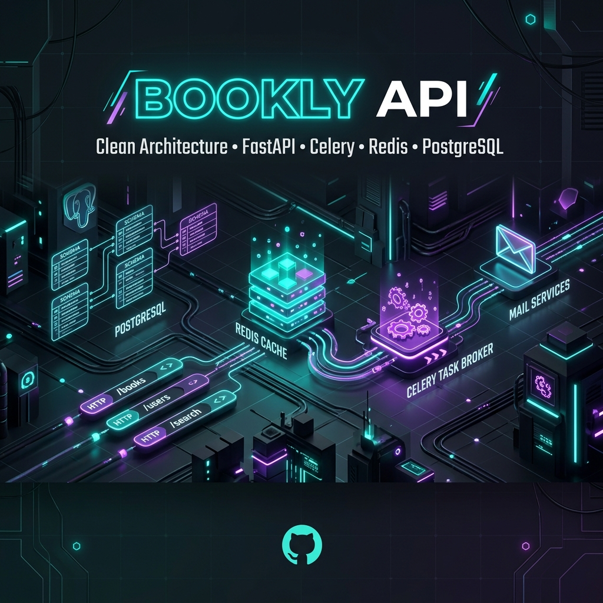
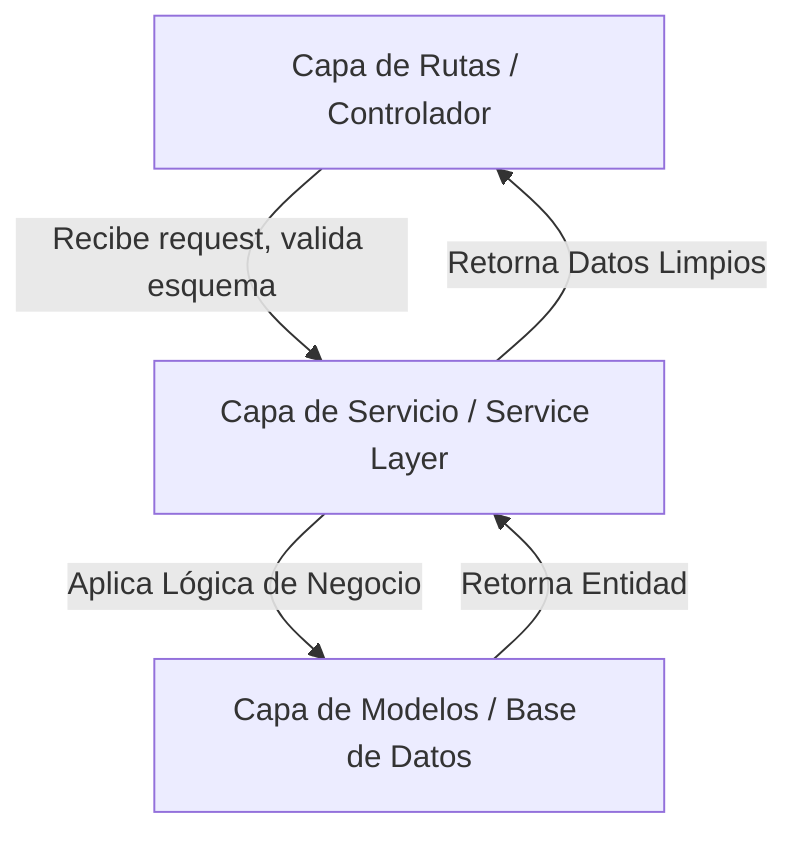
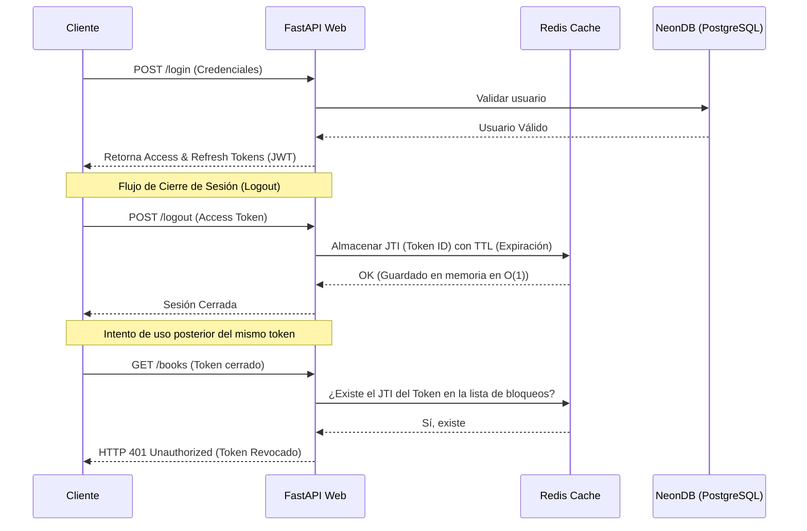

# 📚 Bookly API - Arquitectura Backend Empresarial



Este repositorio es una implementación de producción de una API REST para la gestión de libros, autores, reseñas y etiquetas. Nace de la consolidación y expansión del curso de especialización **"FastAPI Beyond CRUD"** (de *Ssali Jonathan*). 

Este proyecto no solo aplica los fundamentos aprendidos, sino que los rediseña y actualiza bajo los estándares modernos de desarrollo de software empresarial, principios de **Clean Architecture**, asincronía avanzada y aislamiento mediante contenedores (**Docker**). Es un recurso didáctico enfocado en servir como portafolio profesional e implementación de referencia para arquitecturas backend robustas en Python.

---

## 📖 Índice

1. [Conceptos del Curso vs. Buenas Prácticas Aplicadas](#-conceptos-del-curso-vs-buenas-prácticas-aplicadas)
2. [Análisis de Decisiones de Diseño y Arquitectura](#-análisis-de-decisiones-de-diseño-y-arquitectura)
   * [¿Por qué Clean Architecture y Service Layer?](#por-qué-clean-architecture-y-service-layer)
   * [El Poder de la Asincronía Completa (Async/Await)](#el-poder-de-la-asincronía-completa-asyncawait)
3. [Explicación Didáctica de Patrones Clave](#-explicación-didáctica-de-patrones-clave)
   * [Flujo de Autenticación JWT con Redis Blocklist](#1-flujo-de-autenticación-jwt-con-redis-blocklist)
   * [Control de Acceso basado en Roles (RBAC) con Inyección de Dependencias](#2-control-de-acceso-basado-en-roles-rbac-con-inyección-de-dependencias)
   * [Procesamiento Asíncrono de Tareas (Celery + Redis)](#3-procesamiento-asíncrono-de-tareas-celery--redis)
   * [Gestión Profesional de Excepciones Estandarizadas](#4-gestión-profesional-de-excepciones-estandarizadas)
4. [Estructura Detallada del Proyecto](#-estructura-detallada-del-proyecto)
5. [Configuración de Middlewares en Producción](#-configuración-de-middlewares-en-producción)
6. [Despliegue Aislado con Docker Compose](#-despliegue-aislado-con-docker-compose)
7. [Documentación Interactiva de la API](#-documentación-interactiva-de-la-api)
8. [Créditos e Información del Autor](#-créditos-e-información-del-autor)

---

## 🛠️ Conceptos del Curso vs. Buenas Prácticas Aplicadas

| Concepto Base (Curso) | Implementación de Nivel de Producción (Este Proyecto) |
| :--- | :--- |
| **Bases de Datos con SQLModel** | Implementación de persistencia asíncrona avanzada con **SQLAlchemy + SQLModel** usando el driver `asyncpg` y conexión directa a **NeonDB** (PostgreSQL Serverless) en la nube. |
| **Estructura del Proyecto** | Organización bajo **Clean Architecture** y patrón **Service Layer**, separando los módulos y desacoplando la lógica de negocio de los controladores para facilitar pruebas unitarias. |
| **Autenticación JWT** | Seguridad robusta con **Access & Refresh Tokens**. Se agregó invalidación activa mediante una lista de tokens revocados (**Redis Blocklist**) para un Logout seguro. |
| **Control de Acceso (RBAC)** | Sistema de autorización jerárquico basado en Roles y Permisos (`RoleChecker`) inyectados como dependencias de FastAPI. |
| **Manejo de Errores** | Jerarquía de excepciones polimórficas personalizadas (`BooklyException`) y controladores globales que devuelven payloads JSON legibles y consistentes. |
| **Tareas en Segundo Plano** | Delegación de procesos bloqueantes a un gestor de colas asíncrono con **Celery** y **Redis**, como el envío transaccional de correos (`fastapi-mail` + `asgiref`). |
| **Middlewares** | Implementación de middlewares profesionales: CORS, compresión Gzip, filtrado de dominios permitidos (`TrustedHostMiddleware`) y un perfilador de tiempos de respuesta. |
| **Infraestructura** | Virtualización completa del entorno mediante **Docker** y **Docker Compose**, utilizando puertos no comunes para evitar colisiones locales. |

---

## 📐 Análisis de Decisiones de Diseño y Arquitectura

### ¿Por qué Clean Architecture y Service Layer?

En proyectos básicos de FastAPI, la lógica de base de datos y la validación suelen estar acopladas dentro de los mismos archivos de rutas (endpoints). Esto crea problemas a medida que la aplicación crece: los archivos se vuelven gigantescos y las pruebas unitarias se vuelven difíciles porque se depende de la base de datos viva.

Para resolver esto, implementé una estructura basada en **Clean Architecture** dividida en **Capas de Dominio y Servicio**:



1. **Capa de Rutas (Routers)**: Únicamente maneja la capa HTTP (recibir parámetros de consulta, códigos de estado HTTP y serialización de respuestas con esquemas Pydantic).
2. **Capa de Servicio (Service Layer)**: Contiene toda la lógica de negocio. Es agnóstica a cómo se llamaron los endpoints; simplemente recibe variables de Python, interactúa con la base de datos y toma decisiones.
3. **Capa de Modelos (Models)**: Define la estructura relacional de los datos usando `SQLModel` (que une lo mejor de Pydantic y SQLAlchemy en una sola definición).

### El Poder de la Asincronía Completa (Async/Await)

La mayoría de los cuellos de botella en las APIs Web modernas se deben al **I/O Bound** (tiempo de espera para que una base de datos responda, o para que un servicio de terceros responda una petición HTTP). 

Utilizando Python asíncrono (`async`/`await`) con un motor de SQLAlchemy asíncrono (`create_async_engine`) y el driver `asyncpg` (PostgreSQL asíncrono), logramos que un solo hilo de FastAPI atienda miles de peticiones de manera concurrente. Mientras un cliente espera que NeonDB termine de guardar un libro, el hilo de ejecución se libera para procesar el Login de otro usuario, maximizando la eficiencia de los recursos del servidor.

---

## 🔑 Explicación Didáctica de Patrones Clave

### 1. Flujo de Autenticación JWT con Redis Blocklist

Los tokens JWT tradicionales son "estatales en el cliente", lo que significa que el servidor no guarda un registro de ellos para validar la sesión. Esto tiene una gran vulnerabilidad: si un usuario cierra sesión, su token sigue siendo válido en el mundo exterior hasta que expire.

Para solucionar este riesgo de seguridad sin perder los beneficios de rendimiento de JWT, implementamos una **Redis Blocklist**:



Al cerrar sesión, extraemos el `jti` (identificador único del token JWT) y lo guardamos en Redis con un tiempo de vida (TTL) exactamente igual al tiempo restante de validez del token. Si un atacante intenta reutilizar ese token, la base de datos en memoria Redis lo identificará inmediatamente en microsegundos, denegando el acceso.

---

### 2. Control de Acceso basado en Roles (RBAC) con Inyección de Dependencias

FastAPI cuenta con uno de los sistemas de inyección de dependencias más potentes del ecosistema de desarrollo. En este proyecto, creamos una clase llamable llamada `RoleChecker` que funciona como un guardián de rutas dinámico:

```python
class RoleChecker:
    def __init__(self, allowed_roles: list[str]) -> None:
        self.allowed_roles = allowed_roles

    async def __call__(self, current_user: User = Depends(get_current_user)) -> User:
        if current_user.role not in self.allowed_roles:
            raise InsufficientPermission()
        return current_user
```

Al instanciar `Depends(RoleChecker(["admin", "editor"]))`, la ruta intercepta automáticamente la petición, obtiene el usuario actual a través del token, valida su rol contra la lista permitida y, si no tiene los permisos suficientes, lanza un error controlado `InsufficientPermission`.

---

### 3. Procesamiento Asíncrono de Tareas (Celery + Redis)

El envío de un correo de verificación mediante SMTP requiere una conexión TCP con TLS con los servidores de Google (Gmail), lo cual toma entre 1.5 a 3 segundos de espera. Si realizamos este envío de forma síncrona dentro de la petición web, el usuario final percibirá lentitud en el registro de su cuenta.

Para optimizar el diseño, se implementó el **Patrón Productor-Consumidor**:

1. **Productor (FastAPI)**: Registra al usuario en base de datos y manda un mensaje rápido al broker Redis: *"Oye, pon en la cola que se debe enviar un correo a Juan"*. Inmediatamente responde al usuario `HTTP 201 Created`.
2. **Broker (Redis)**: Almacena la tarea de manera temporal en la cola de tareas.
3. **Consumidor (Celery Worker)**: Un proceso independiente lee la cola en Redis de manera asíncrona, extrae los parámetros y realiza el handshake SMTP con Gmail de forma segura en segundo plano sin interrumpir el servidor web.

Si el servidor de correos cae temporalmente, Celery cuenta con políticas de reintento automático con backoff exponencial para garantizar la entrega:

```python
@celery_app.task(bind=True, max_retries=5, default_retry_delay=15)
def send_email_task(self, email_to: str, subject: str, html_content: str):
    # Lógica de envío de correo...
    except Exception as exc:
        raise self.retry(exc=exc) # Auto-reintento
```

---

### 4. Gestión Profesional de Excepciones Estandarizadas

Exponer trazas de error (`Tracebacks`) del servidor en producción es un grave fallo de seguridad. Además, devolver errores en formatos inconsistentes (unas veces texto plano, otras JSON plano) dificulta el consumo de la API por parte del equipo Frontend.

Implementamos un sistema de control de excepciones polimórfico:
* **Excepción Base (`BooklyException`)**: Hereda de la clase `Exception` nativa de Python y define atributos como `status_code`, `message`, `error_code`, y `resolution`.
* **Excepciones Especializadas**: Clases como `UserAlreadyExists`, `BookNotFound`, o `InvalidToken` heredan de `BooklyException` sobrescribiendo únicamente sus valores característicos.
* **Manejador de Errores Global**: FastAPI captura cualquier error derivado de `BooklyException` y devuelve una respuesta estructurada:

```json
{
  "message": "El token proporcionado es inválido o ha expirado",
  "error_code": "invalid_token",
  "resolution": "Por favor, solicita un nuevo token de acceso"
}
```

---

## 📂 Estructura Detallada del Proyecto

El backend se encuentra modularizado por componentes funcionales del dominio para asegurar un mantenimiento limpio:

```text
├── src/
│   ├── core/                  # Configuraciones de seguridad, middlewares y dependencias
│   │   ├── dependencies.py    # Guardianes de seguridad (get_current_user, RoleChecker)
│   │   └── security.py        # Configuración de JWT y hashers de contraseña
│   ├── database/              # Conexión asíncrona, modelos globales y Redis blocklist
│   │   ├── main.py            # Inicialización de la sesión asíncrona de SQLAlchemy
│   │   ├── models.py          # Modelos de bases de datos del sistema relacional
│   │   └── redis.py           # Cliente Redis y almacenamiento de JWT revocados
│   ├── modules/               # Módulos de dominio funcional (Clean Architecture)
│   │   ├── auth/              # Registro, Login, Recuperación y Roles de Usuario
│   │   ├── authors/           # CRUD de Autores
│   │   ├── books/             # CRUD de Libros
│   │   ├── reviews/           # Reseñas de libros por usuario
│   │   └── tags/              # Etiquetas asociadas a libros (Relaciones muchos a muchos)
│   ├── celery_task.py         # Inicialización de Celery y definición de tareas asíncronas
│   ├── errors.py              # Excepciones personalizadas y manejadores globales de errores
│   ├── mail.py                # Cliente de configuración de correo (FastMail)
│   ├── middleware.py          # Registro de middlewares globales de la aplicación
│   └── __init__.py            # Punto de entrada de la aplicación FastAPI
├── migrations/                # Migraciones de base de datos administradas por Alembic
├── docker-compose.yml         # Orquestación de contenedores (API, Redis, Celery)
├── Dockerfile                 # Receta de construcción de la imagen de producción
└── requirements.txt           # Dependencias de producción del proyecto
```

---

## 🛡️ Configuración de Middlewares en Producción

En [**`src/middleware.py`**](file:///c:/Users/lordm/Desktop/Proyectos%20y%20clases/pyThonPro/BackEndFastAPI/src/middleware.py) registramos middlewares de producción para asegurar la velocidad y resiliencia de la API:

1. **Custom Logging Middleware**: Calcula de manera exacta con `time.perf_counter()` el tiempo de procesamiento de cada petición HTTP en milisegundos y lo escribe en el log de accesos en consola.
2. **CORS (Cross-Origin Resource Sharing)**: Habilita y restringe el acceso de clientes externos (Frontends en React, Vue, etc.) asegurando que solo dominios de confianza puedan comunicarse con la API.
3. **Trusted Host Middleware**: Evita ataques de inyección de cabeceras Host asegurando que la API solo acepte peticiones dirigidas a nombres de dominio aprobados (como `localhost` o tu dominio de producción).
4. **GZip Compression**: Comprime de forma automática cualquier respuesta JSON mayor a 1KB antes de mandarla al cliente, reduciendo drásticamente el consumo de ancho de banda y acelerando la navegación.

---

## 🐳 Despliegue Aislado con Docker Compose

Para evitar conflictos de puertos con tus bases de datos o servicios Redis locales, el proyecto está completamente dockerizado utilizando puertos poco comunes:

* **API de FastAPI**: Expuesta en el puerto **`8099`**
* **Redis Broker**: Expuesto en el puerto **`6479`**
* **Base de Datos**: NeonDB (Servicio en la nube).

### Instrucciones de Arranque

1. **Configurar Variables de Entorno**:
   Copia la plantilla y configura tus credenciales reales (NeonDB y credenciales SMTP):
   ```bash
   cp .env.example .env
   ```
2. **Compilar y Levantar la Arquitectura**:
   ```bash
   docker compose up --build -d
   ```
3. **Verificar Estado de Contenedores**:
   ```bash
   docker compose ps
   ```

---

## 📖 Documentación Interactiva de la API

Una vez levantados los contenedores, la documentación oficial está disponible en:

* **Swagger UI (OpenAPI)**: [http://localhost:8099/docs](http://localhost:8099/docs) – Ideal para pruebas interactivas de endpoints y validación de schemas de entrada/salida.
* **Redoc UI**: [http://localhost:8099/redoc](http://localhost:8099/redoc) – Ideal para visualización técnica estructurada y limpia.

---

## 👤 Autor

* **Desarrollador**: Albert Mijael Garayar Munive (Tech Lead & Full Stack Software Engineer)
* **Correo**: [mijael.gara@gmail.com](mailto:mijael.gara@gmail.com)
* **LinkedIn**: [albert-mijael-garayar-munive](https://linkedin.com/in/albert-mijael-garayar-munive/)
* **GitHub**: [Gimms11](https://github.com/Gimms11)
